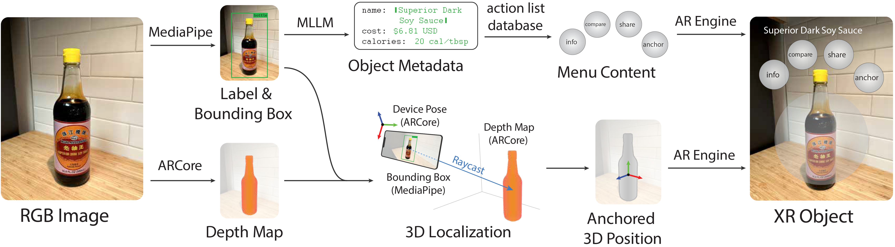

## Abstract

Seamless integration of physical objects as interactive digital entities remains a challenge for spatial computing. This paper introduces Augmented Object Intelligence (AOI), a novel XR interaction paradigm designed to blur the lines between digital and physical by endowing real-world objects with the ability to interact as if they were digital, where every object has the potential to serve as a portal to vast digital functionalities. Our approach utilizes object segmentation and classification, combined with the power of Multimodal Large Language Models (MLLMs), to facilitate these interactions. We implement the AOI concept in the form of XR-Objects, an open-source prototype system that provides a platform for users to engage with their physical environment in rich and contextually relevant ways. This system enables analog objects to not only convey information but also to initiate digital actions, such as querying for details or executing tasks. Our contributions are threefold: (1) we define the AOI concept and detail its advantages over traditional AI assistants, (2) detail the XR-Objects system's open-source design and implementation, and (3) show its versatility through a variety of use cases and a user study.

## Implementation

XR-Objects leverages developments in spatial understanding via tools such as SLAM, available in [Google ARCore](https://developers.google.com/ar) and [Apple ARKit](https://developer.apple.com/augmented-reality/arkit/), and machine learning models for object segmentation and classification (COCO via [MediaPipe](https://ai.google.dev/edge/mediapipe/solutions/guide)), that enable us to implement AR interactions with semantic depth. We also integrate a Multimodal Large Language Model (MLLM), [Google Gemini](https://deepmind.google/technologies/gemini/), into our system, which further enhances our ability to automate the recognition of objects and their specific semantic information within XR spaces.
