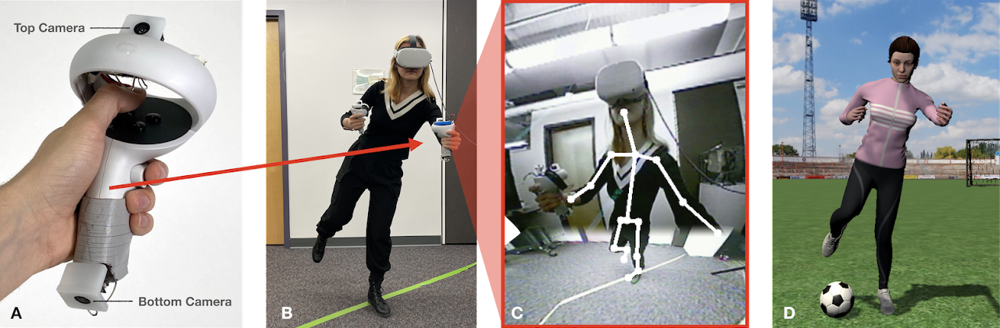

## Abstract

We present a new and practical method for capturing user body pose in virtual reality experiences: integrating cameras into handheld controllers, where batteries, computation and wireless communication already exist. By virtue of the hands operating in front of the user during many VR interactions, our controller-borne cameras can capture a superior view of the body for digitization. Our pipeline composites multiple camera views together, performs 3D body pose estimation, uses this data to control a rigged human model with inverse kinematics, and exposes the resulting user avatar to end user applications. We developed a series of demo applications illustrating the potential of our approach and more leg-centric interactions, such as balancing games and kicking soccer balls. We describe our proof-of-concept hardware and software, as well as results from our user study, which point to imminent feasibility.

