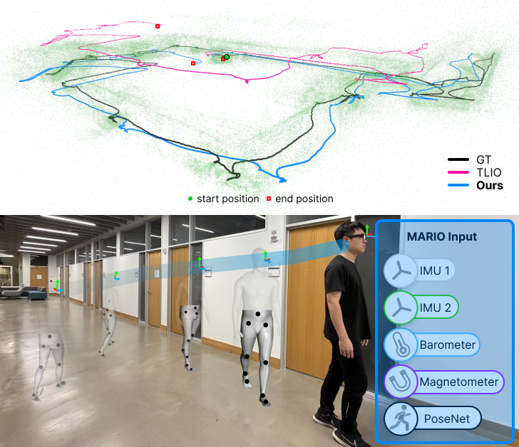
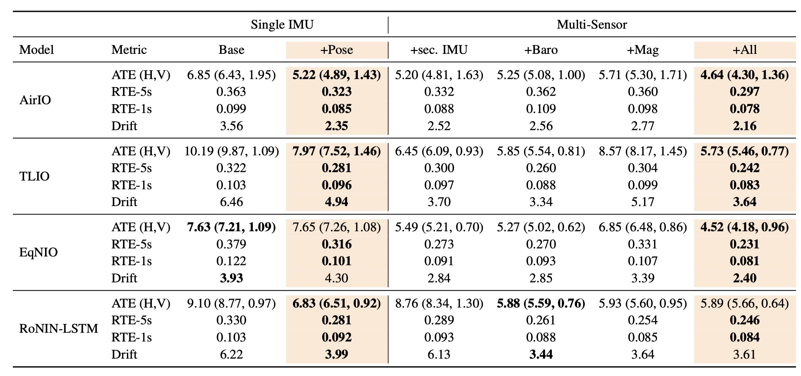

## Abstract

Inertial odometry (IO) using only inertial measurement units (IMUs) provides a lightweight solution for human motion tracking in augmented reality (AR) and wearable devices. Recent learning-based IO methods have improved the generalizability of inertial localization through large-scale pretraining on human motion datasets. However, these approaches remain prone to drift and noise because they fail to capture human motion dynamics, especially on daily activity datasets such as Nymeria.

To address this limitation, we ground inertial odometry in human kinematics through a learned IMU-inferred pose prior that encourages the propagation of physically consistent motion constraints. We integrate this pose prior into existing IO architectures and reduce positional drift by up to 36% on the challenging Nymeria dataset, which is 5x larger than those used in prior work.

We further improve long-term performance through a sensor-fusion framework that incorporates auxiliary signals from lightweight sensors already available on commercial AR glasses, including the magnetometer, barometer, and a secondary IMU. With this fusion strategy, drift is reduced by up to 42%, improving robustness and generalization across diverse motion conditions. Together, our results establish a new paradigm for inertial and lightweight odometry by unifying human motion kinematics with multimodal sensing, setting a new benchmark for accurate and robust camera-less human tracking.

## Experimental Results on Nymeria

We benchmark MARIO on Nymeria, a challenging daily-activity inertial dataset, and compare it with prior inertial odometry approaches. Our method improves robustness and reduces positional drift by leveraging human motion-aware pose priors together with lightweight multimodal fusion.

Table 1. Quantitative results on the Nymeria dataset. MARIO improves inertial odometry accuracy over prior baselines, especially in drift-sensitive settings.
