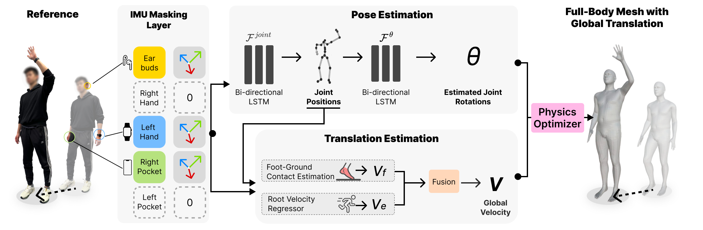
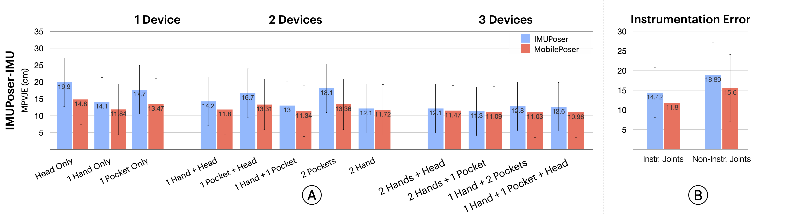

## Abstract

In this work we develop 3D Paintbrush, a technique for automatically texturing local semantic regions on meshes via text descriptions. Our method is designed to operate directly on meshes, producing texture maps which seamlessly integrate into standard graphics pipelines. We opt to simultaneously produce a localization map (to specify the edit region) and a texture map which conforms to it. This synergistic approach improves the quality of both the localization and the stylization. To enhance the details and resolution of the textured area, we leverage multiple stages of a cascaded diffusion model to supervise our local editing technique with generative priors learned from images at different resolutions. Our technique, referred to as Cascaded Score Distillation (CSD), simultaneously distills scores at multiple resolutions in a cascaded fashion, enabling control over both the granularity and global understanding of the supervision. We demonstrate the effectiveness of 3D Paintbrush to locally texture a variety of shapes within different semantic regions.

## Network Overview

Lorem ipsum dolor sit amet, consectetur adipiscing elit. Sed ac metus in sapien congue bibendum. Nulla facilisi. Donec vel est vel sapien malesuada malesuada.

## Impact of simultaneous optimization

Lorem ipsum dolor sit amet, consectetur adipiscing elit. Sed ac metus in sapien congue bibendum. Nulla facilisi. Donec vel est vel sapien malesuada malesuada. Check out our [GitHub repository](https://github.com/example/repo) for more info.
