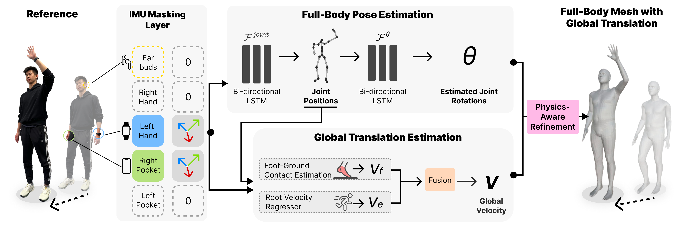

## Abstract

There has been a continued trend towards minimizing instrumentation for full-body motion capture, going from specialized rooms and equipment, to arrays of worn sensors and recently sparse inertial pose capture methods. However, as these techniques migrate towards lower-fidelity IMUs on ubiquitous commodity devices, like phones, watches, and earbuds, challenges arise including compromised online performance, temporal consistency, and loss of global translation due to sensor noise and drift. Addressing these challenges, we introduce MobilePoser, a real-time system for full-body pose and global translation estimation using any available subset of IMUs already present in these consumer devices. MobilePoser employs a multi-stage deep neural network for kinematic pose estimation followed by a physics-based motion optimizer, achieving state-of-the-art accuracy while remaining lightweight. We conclude with a series of demonstrative applications to illustrate the unique potential of MobilePoser across a variety of fields, such as health and wellness, gaming, and indoor navigation to name a few.

## System Overview

MobilePoser accepts any available subset of IMU data from the user and masks absent devices by setting their values to zero. The IMU data is then fed into two main modules: (1) Pose Estimation, which first estimates joint positions followed by joint rotations, and (2) Translation Estimation, which combines foot-ground contact probabilities with a direct neural network-based approach to regress global velocity. Finally, a Physics Optimizer refines the predicted joint rotations and global translation to ensure they satisfy  physical constraints.

