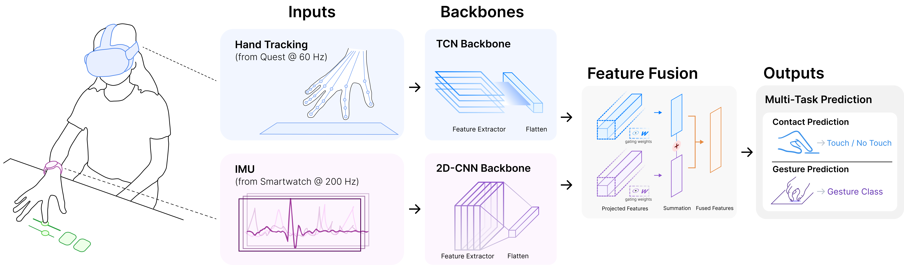

## Abstract

Mid-air gestures in Extended Reality (XR) often lead to fatigue, discomfort, and imprecision, limiting their suitability for extended use, while surface-based interactions offer a compelling alternative by providing improved accuracy, speed, and comfort; however, current egocentric vision-based methods struggle with reliable surface inputs due to challenges in hand tracking and surface plane estimation from oblique and occluded viewing angles. To this extent, we introduce SurfaceXR, a novel sensor fusion approach that combines headset-based hand tracking with micro-vibration data sampled from commodity smartwatch IMUs to enable precise and robust inputs on everyday surfaces. Our system is designed with flexibility in mind—it can function using only hand tracking, only IMU sensing, or optimally with both modalities combined, and remains robust even without explicit surface calibration. Our key insight is that these modalities are complementary: hand tracking provides 3D positional data of hand joints, whereas IMUs supply high-frequency wrist and hand motion data. Our user study across 21 participants validates SurfaceXR's effectiveness in augmenting surface touch tracking and 8-class hand-surface gesture recognition, demonstrating significant improvements over single-modality approaches, and enabled by SurfaceXR, we demonstrate a series of interactive apps for both AR and VR, ranging from on-surface sketching, text entry, and gesture-based navigation.

## System Overview

