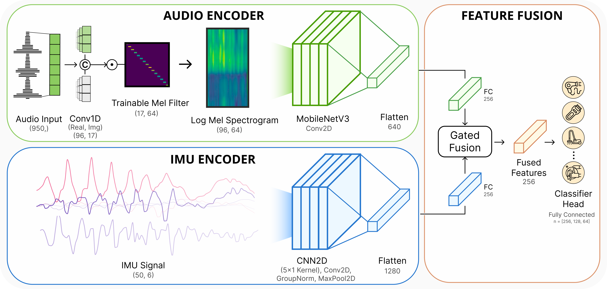

## Abstract

Despite advances in practical and multimodal fine-grained Human Activity Recognition (HAR), a system that runs entirely on smartwatches in unconstrained environments remains elusive. We present WatchHAR, an audio and inertial-based HAR system that operates fully on smartwatches, addressing privacy and latency issues associated with external data processing. By optimizing each component of the pipeline, WatchHAR achieves compounding performance gains. We introduce a novel architecture that unifies sensor data preprocessing and inference into an end-to-end trainable module, achieving 5x faster processing while maintaining over 90% accuracy across more than 25 activity classes. WatchHAR outperforms state-of-the-art models for event detection and activity classification while running directly on the smartwatch, achieving 9.3 ms processing time for activity event detection and 11.8 ms for multimodal activity classification. This research advances on-device activity recognition, realizing smartwatches' potential as standalone, privacy-aware, and minimally-invasive continuous activity tracking devices.

## System Overview

The model processes 1-second windows of raw audio and 6-axis IMU data to predict activities. Audio preprocessing is integrated directly into the neural network as trainable layers.

